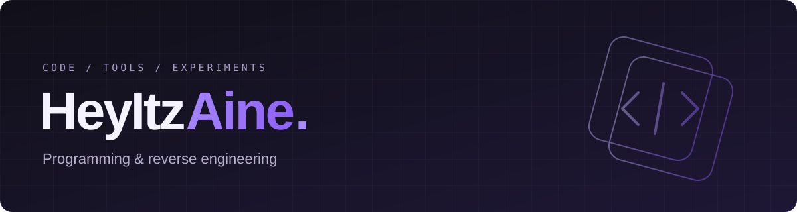

  

  <a href="#about">About</a> &nbsp; / &nbsp;
  <a href="#projects">Projects</a> &nbsp; / &nbsp;
  <a href="#tools">Tools</a> &nbsp; / &nbsp;
  <a href="#activity">Activity</a>

## About

I go by Aine. I program and reverse engineer as a hobby.

My projects include Android utilities, desktop tools, and Minecraft datapacks. Sometimes it's a small fix for something that annoys me; sometimes it's a reason to figure out how something works.

## Projects

| Project | What it does |
| :--- | :--- |
| [OneTapDND](https://github.com/HeyItzAine/OneTapDND) | Brings back single-tap Do Not Disturb in Android quick settings. |
| [LGHub Roblox Path Syncer](https://github.com/HeyItzAine/LGHub-Roblox-Path-Syncer) | Keeps G HUB pointed at the latest Roblox executable after updates, without a restart. |
| [PiggyBack](https://github.com/HeyItzAine/PiggyBack-Mc-Datapack) | Carry another player in vanilla Minecraft using clickable chat requests. |
| [ItemFilterHelper](https://github.com/HeyItzAine/ItemFilterHelper) | Copies one of each unique item between chests to help build item sorting systems. |

[Browse all repositories ↗](https://github.com/HeyItzAine?tab=repositories)

## Tools

**Languages** &nbsp; `JavaScript` · `TypeScript` · `Python` · `HTML` · `CSS`

**Web & workflow** &nbsp; `React` · `Node.js` · `Git`

## Activity

<picture>
  <source media="(prefers-color-scheme: dark)" srcset="https://raw.githubusercontent.com/HeyItzAine/heyitzaine/output/github-snake-dark.svg" />
  <source media="(prefers-color-scheme: light)" srcset="https://raw.githubusercontent.com/HeyItzAine/heyitzaine/output/github-snake.svg" />
  
</picture>

<a href="https://github.com/HeyItzAine?tab=overview">View contributions on GitHub ↗</a>

